# 🧠 TheraMind – Therapy of Mind

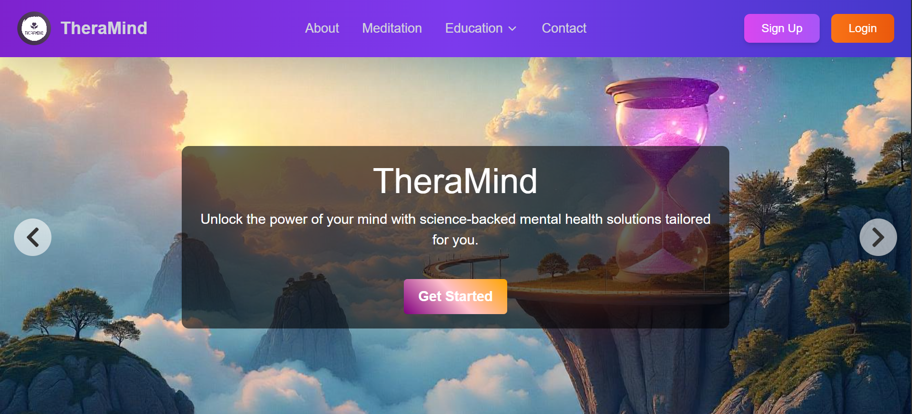

---

## 👥 Contributors  

This project was a collective effort, where each member handled **core features and critical components** of TheraMind. Each team member devoted their full energy and commitment throughout the stages of project conceptualization, development, testing, and deployment.

- **Abdullah Imran** – Developed **Authentication, TheraChat (AI Chatbot), Education Module, and Treatment Plan System** across both frontend and backend. Trained and deployed all **AI models** in the backend, managed full **project deployment**, and contributed to **dataset preparation** for model development.  

- **Ambreen** – Designed and implemented the **Questionnaire & Diagnosis System**, built the complex **Appointment Booking & Management workflows**, and developed the **About Us** and **Contact Us** pages. Also contributed to **dataset preparation** for AI model training.  

- **Hamda Qadeer** – Created the **Homepage**, **Meditation Module**, and the comprehensive **Admin Panel**. Additionally, contributed significantly to **dataset preparation** for AI model training.  


*Final Year Project (2025) – University of Management and Technology, Lahore*

---

## 📌 About the Project

TheraMind is a **web-based mental health support platform** that guides individuals **from initiation to actionable treatment plans**. It provides **personalized mental health support** across five major conditions — **Stress, Trauma, Depression, Anxiety, and OCD** — each with three subtypes.

Unlike traditional systems, TheraMind combines **questionnaire-based diagnosis, appointment booking, treatment plan design, AI-driven chat support, educational content, and meditation exercises** into one coherent ecosystem.

---

## 🚀 Core Features

### 👤 Patient View
- Signup & complete a guided **questionnaire**
- Receive a **personalized diagnosis & recommendations**
- Book & attend **doctor appointments** via Google Meet
- Access a structured **treatment plan** designed by your doctor
- Explore **educational content** (articles, patient stories)
- Use **meditation timers & guided videos**
- Interact with **TheraChat (AI-powered empathetic chatbot)**

### 👨‍⚕️ Doctor View
- Register & wait for **admin approval**
- Manage available **appointment slots**
- Conduct **video appointments** with patients
- Design & update **treatment plans** (goal-action structure with versioning & priority levels)
- Write & publish **articles**
- Use **TheraChat** for support and research

### 🛠️ Admin View
- Approve or block doctors
- Manage patient/doctor accounts
- Oversee **system analytics** (Firebase Analytics)
- Communicate with developers for escalations

---

## 🧩 Complete Feature Set

- **Meditation** → Breathing timers + curated YouTube video library
- **Education** → Tag-based article & patient story browsing
- **Write** → Patients submit stories, doctors publish articles (AI filters for relevance using CNN+SBERT)
- **Treatment Plans** → Immutable, weekly versioned, with weighted actions (priority levels 1–3)
- **Questionnaire** → Multi-stage diagnosis with suicide-risk detection & tailored condition-specific questions
- **Appointments** → Google Meet integration, rescheduling, cancellation, and email reminders
- **TheraChat** → Gemini-powered chatbot with custom fine-tuning for:
  1. Empathetic support
  2. Knowledge-based answers
  3. Refusal on irrelevant queries

---

## 🏗️ System Architecture

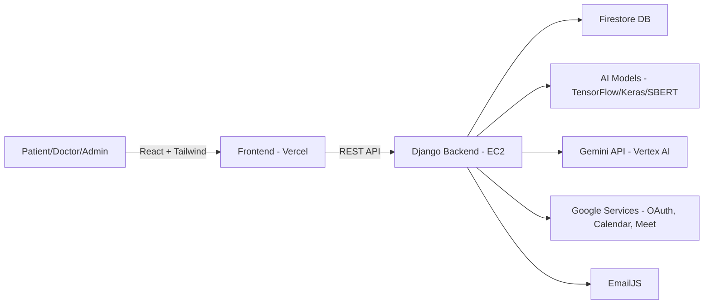

---

## 🛠️ Tech Stack

### Core Technologies
- **React JS** - Frontend framework
- **Tailwind CSS** - Styling and design
- **Django** - Backend framework
- **Google Firestore** - NoSQL database
- **Google Firebase** - Authentication

### Additional Integrations
- **AI/NLP** → TensorFlow, Keras, NLTK, Hugging Face, SBERT + CNN
- **Chatbot** → Gemini API + Vertex AI endpoint
- **Authentication** → Google Identity Services (OAuth 2.0)
- **Appointments** → Google Calendar + Meet APIs
- **Notifications** → EmailJS
- **Analytics** → Firebase Analytics

---

## ⚙️ Deployment Setup

| Component | Service Used | Notes |
|-----------|--------------|-------|
| Frontend | Vercel | Hosts React + Tailwind app |
| Backend | Amazon EC2 | Django + AI Models deployed |
| Domain | Hostinger + NGINX | theramind.site → Vercel, api.theramind.site → EC2 |
| Models | EC2 (TensorFlow, SBERT + 1D-CNN) | Served via backend |
| Collaboration Tools | GitHub, ClickUp, Google Colab | VCS + Agile + Model Training |

---

## 📷 Screenshots & UI Showcase

### Patient Dashboard
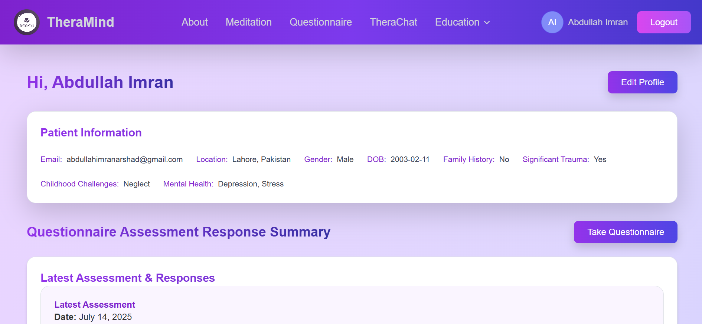

### Doctor Dashboard
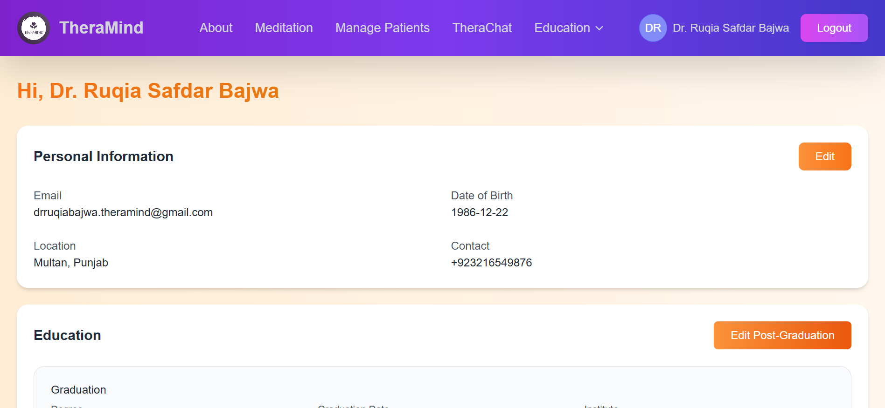

### Admin Panel
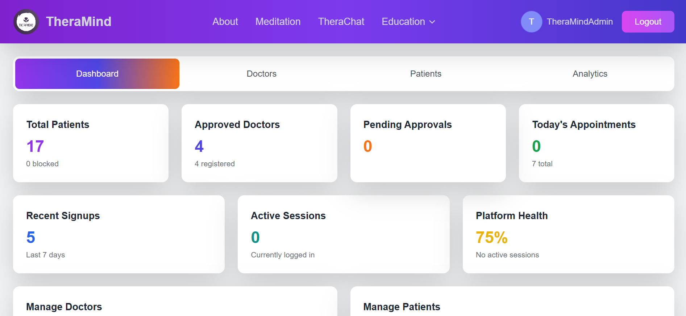

### TheraChat (AI Chatbot)
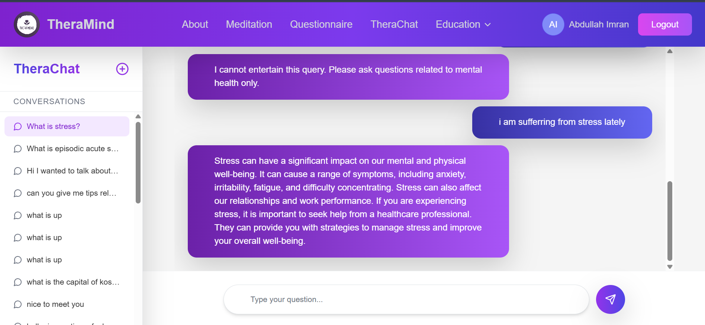

### Meditation
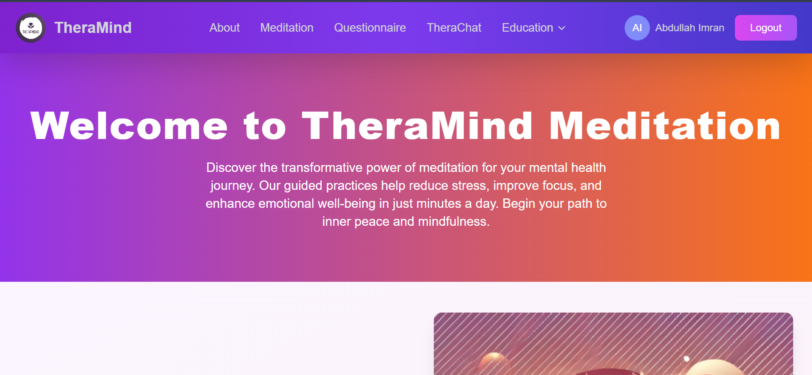

### Education
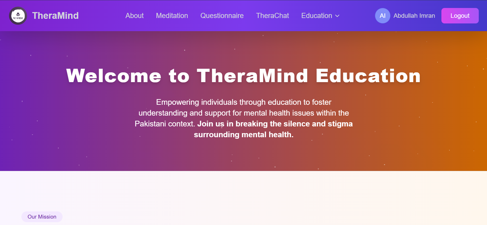

### Content Filtering
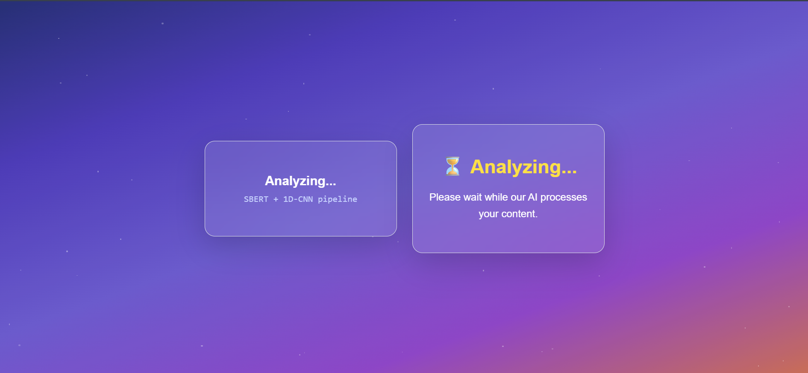

### Questionnaire
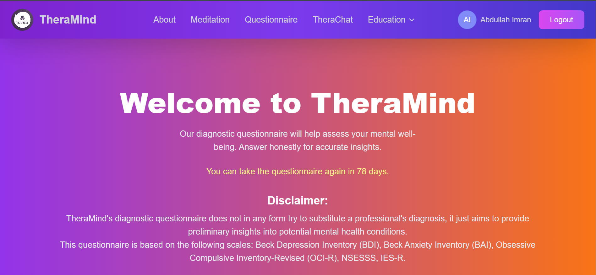

### Treatment Plan
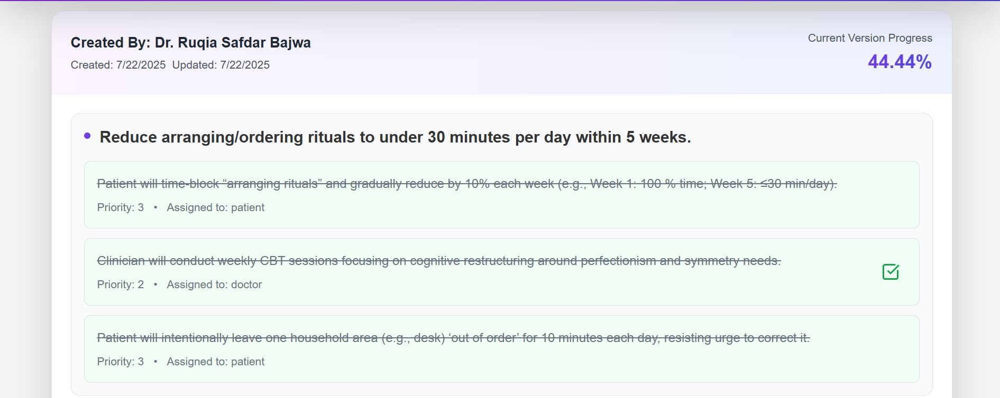

### Appointment
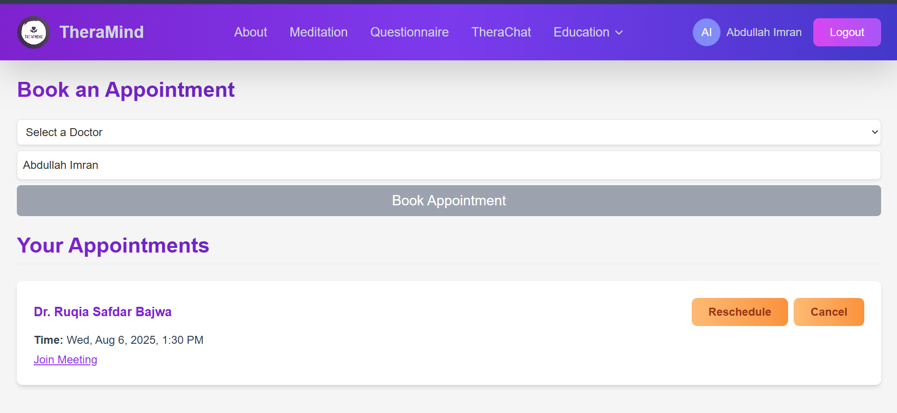

---

## 🧪 AI Models & Experiments

We experimented with multiple architectures for content filtering & chatbot training:

- **Initial Attempts**: Logistic Regression, LSTM, GRU, BiLSTM → Encountered overfitting issues
- **Final Solution**: SBERT + 1D CNN (with negative mining + noise injection) → Achieved stable & accurate classification

## Classification Report (Content Filtering)

| Class | Precision | Recall | F1-Score | Support |
|-------|-----------|--------|----------|---------|
| Non-MH | 0.95 | 1.00 | 0.97 | 109 |
| MH | 1.00 | 0.94 | 0.97 | 109 |
| **Accuracy** | | | **0.97** | **218** |
| **Macro Avg** | **0.97** | **0.97** | **0.97** | **218** |
| **Weighted Avg** | **0.97** | **0.97** | **0.97** | **218** |

### Gemini Fine-tuning Evolution:
- **V1** → Over-restricted, failed to answer knowledge questions
- **V2** → Retrained with expanded dataset → Achieved balanced empathy + knowledge

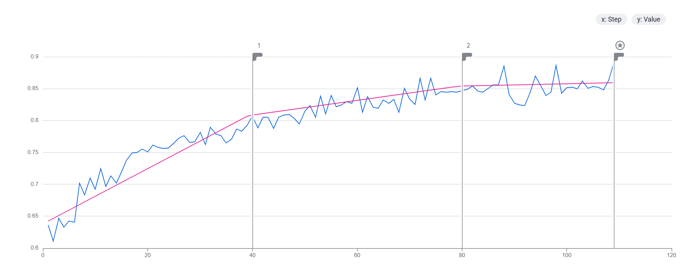

---

## 🧑‍💻 Challenges & Learnings

- **Dependency Conflicts** → TensorFlow & NLP libraries caused major conflicts, resolved via environment isolation
- **Cloud Deployment** → Models ran fine locally but failed in Docker/EC2 initially → resolved with optimized images
- **Google OAuth Approval** → Successfully navigated security checks for sensitive scopes
- **AI Fine-tuning** → Achieved balance between empathy & knowledge after multiple dataset iterations

---

## 📥 Getting Started

### Clone & Setup
```bash
git clone https://github.com/poetabdullah/theramind.git
cd theramind
```

### Frontend Setup
```bash
npm install
npm start
```

### Backend Setup
```bash
cd backend
venv\scripts\activate
pip install -r requirements.txt
python manage.py runserver
```

### Environment Variables Required
- Firebase credentials
- Gemini API keys
- Google OAuth credentials
- EmailJS configuration

---


## 📄 License

This project was developed as an academic final year project. Usage permissions can be discussed upon request.

---

## 🔗 Links

- **Live Demo**: [theramind.site](https://theramind.site)
- **Project Repository**: [GitHub](https://github.com/poetabdullah/theramind)

---

*Built with ❤️ for mental health awareness and support*
